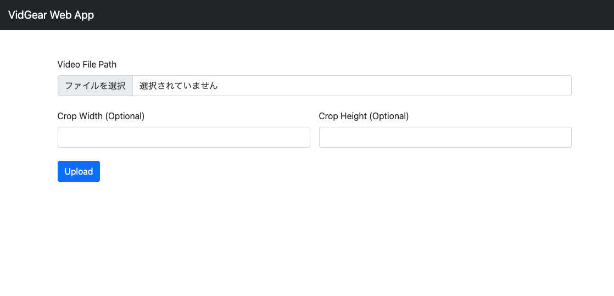
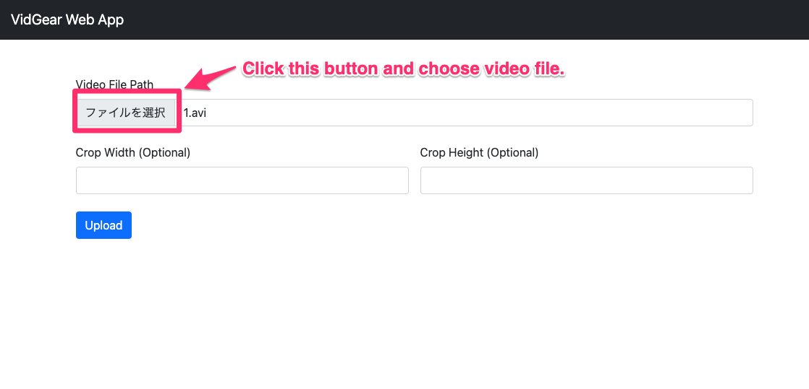
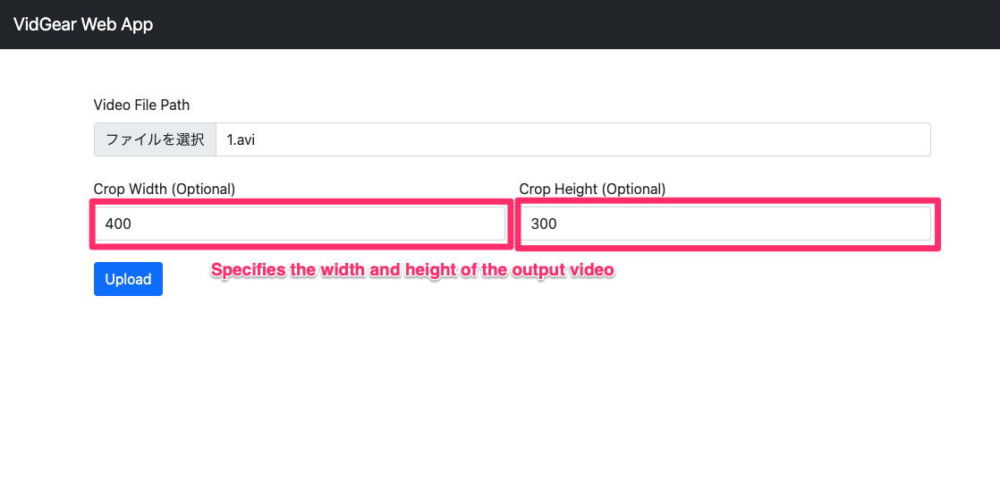
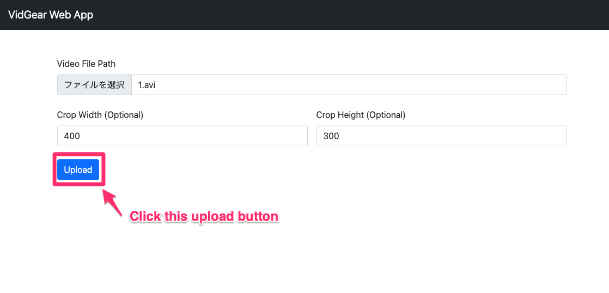

# Overview
This is a web application to use [VidGear](https://github.com/abhiTronix/vidgear) Stabilizer which can make any video source stabilize easily.

# How To Install

## Step1: Install docker and docker-compose
install docker according to this [manual](https://docs.docker.com/docker-for-mac/install/)

## Step2: Start application with docker-compose 
execute the following command in terminal.

```shell
docker-compose up
```

## Step3: Access to the URL via web browser
Access to the following URL of this web application via web browser  
- [http://localhost:8000](http://localhost:8000)

# How To Use

## Step1: Open the URL on browser


## Step2: Upload target video
Click file selection button and choose the targe video file.


## Step3 (Optional): Specify width and height of the output video
Specify width and height of the output video
If you cannot specify these value, the size of output video becomes the same as input.



## Step4: Upload Image
Click the Upload button to run the process, and after a while, you can download the video.  




# Licence
MIT License